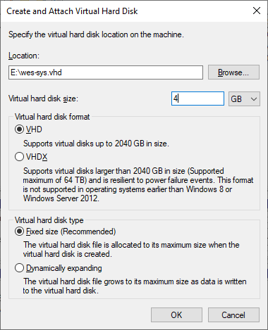
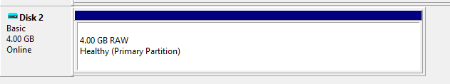
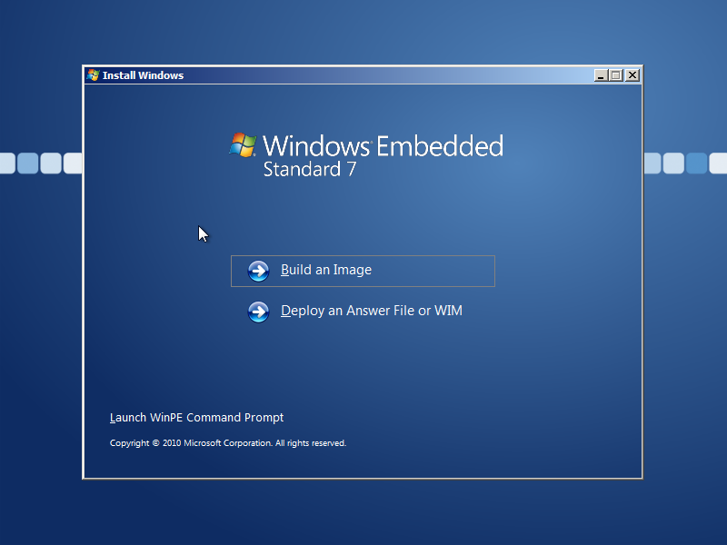
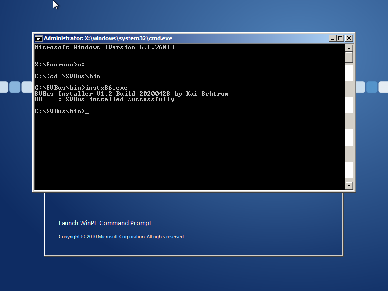
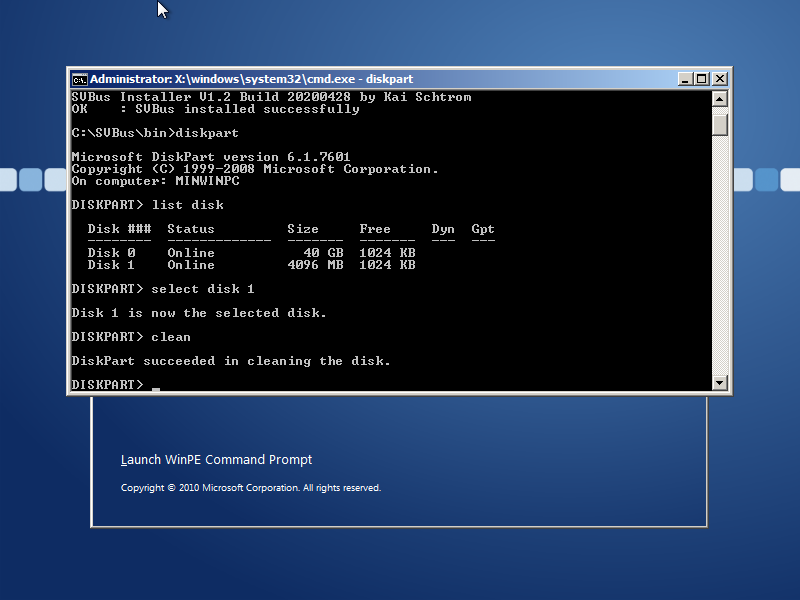
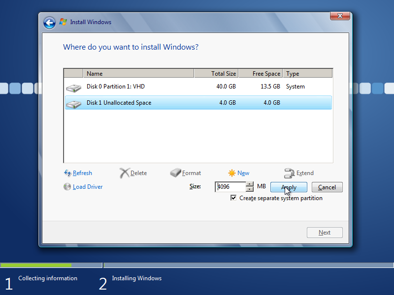
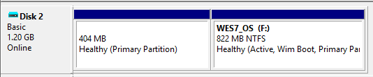

# Running Windows Embedded Standard 7 on a RAMDisk
Basic setup of WES 7 running from an SVBus VHD, either from disk or from RAM using Grub4dos.

## Requirements
* [Windows Embedded Standard 7](https://www.microsoft.com/en-us/download/details.aspx?id=11887) - The evaluation copy x86 IBW is used here. The Toolkit is required for GUI modification of the answer file.
* [SVBus 1.2](https://sourceforge.net/projects/svbus/files/SVBus_V1.2_20200428.rar/download)
* WofADK.sys from the [Windows 10 1507 ADK](http://download.microsoft.com/download/8/1/9/8197FEB9-FABE-48FD-A537-7D8709586715/adk/adksetup.exe) - Other versions may work. Grab the driver from the `ADK folder\Deployment Tools\x86\DISM` folder.
* [Grub4dos](https://github.com/chenall/grub4dos) - 0.4.6a used here
* [Wimlib](https://wimlib.net/) - v1.13.3 used here
* [lz4_compressor](http://reboot.pro/index.php?showtopic=22062)
* [Sample answer file](MiniWES7.xml)
* [WimBootCompress.ini](WimBootCompress.ini)
* [wof.bat](wof.bat)

## Grub4dos configuration
Open the grub4dos binary in a hex editor, and replace the embedded script at offset 0x50988 with `commandline`.

## Target configuration
* Configure a separate disk large enough for the VHDs and grub4dos. This disk should have a single, active NTFS partition.
* Place the modified grub4dos binary at the root of the drive named `bootmgr`.
* Create a **fixed-size** VHD on the drive initialized as MBR and with a single partition of any type. This partition will be deleted during WES 7 setup. The size of the VHD should be at least 4GB for this configuration, but may need to be larger if more components are desired.

* Copy the Windows Embedded Standard 7 x86 IBW ISO to the root of the disk.
* Copy the SVBus driver to the \SVBus folder on the disk.

## Install WES 7
* Boot the target system into a grub4dos command line using the previously configured disk.
* Map the VHD and ISO, and boot the system, where `wes.vhd` is the VHD and `wes.iso` is the WES 7 x86 IBW ISO.
    * `find --set-root /wes.vhd`
    * `map /wes.vhd (hd0)`
    * `map /wes.iso (0xff)`
    * `map --hook`
    * `chainloader (0xff)`
    * `boot`
* The system should now boot to the WES 7 IBW.

* Open a command prompt with Shift+F10 and run `instx86` from the `SVBus\bin` directory on the physical disk containing the drivers and VHDs.

* Verify the disk appears in `diskpart` and clean the disk.

* Run setup and install Windows to the VHD. During partition creation, enable separate system partition to prevent boot files from being captured in the WIM later on.

* After each reboot map the VHD and boot the system, where `wes.vhd` is the VHD.
    * `find --set-root /wes.vhd`
    * `map /wes.vhd (hd0)`
    * `map --hook`
    * `chainloader (hd0)+1`
    * `boot`

## Configure WES 7
* Copy WimbootCompress.ini to C:\Windows\System32.
* Copy WofADK.sys to C:\Windows\System32\drivers.
* Run Wof.bat to add WofADK.sys to the registry.
* Finish configuring the image and shut down once complete.

## Capturing the WIM
* Mount the VHD to the designer system.
* Capture the WIM using max LZX compression with wimboot enabled from an administrator command prompt, where `wes7.wim` is the WIM file and `X:` is the OS partition.
    * `wimlib-imagex capture X:\ wes7.wim --compress=LZX:100 --wimboot`
* Unmount the VHD.

## Final VHD creation and WIM application
* On the designer system, create a VHD that is at least twice the size of the WIM, the actual size of the system partition can vary depending on needs. This VHD should be initialized as MBR and the WIM partition just large enough for the WIM. Free space should be under 1MB to avoid wasting space in the VHD.
* Copy the created WIM to the WIM partition on the created VHD.
* Create the OS partition and mark it active.
* Apply the WIM to the OS partition from the WIM partition from an administrator command prompt, where `wes7.wim` is the WIM file and `X:` is the OS partition.
    * `wimlib-imagex apply wes7.wim X:\ --wimboot`
* Make the new VHD bootable.
    * `bootsect /nt60 X: /mbr`
    * `bcdboot X:\Windows /l en-US /s X:`
* Hide the WIM partition by setting the ID to 17 in `diskpart`, where `X` is the VHD.
    * `select disk X`
    * `select part 1`
    * `set id=17`

## VHD compression (optional)
The VHD can be compressed with LZ4 if desired to take up less space on disk. This compressed VHD can only be used in ramdisk mode, file-backed VHDs require the uncompressed VHD to be mapped. See http://reboot.pro/index.php?showtopic=22062.

## Booting the final VHD
### RAMDisk mode (non-persistent)
Boot the target system into grub4dos, where `wesram.vhd.lz4` is the LZ4 compressed VHD containing the wimboot WES 7 system.
* `find --set-root /wesram.vhd.lz4`
* `map --mem --top /wesram.vhd.lz4 (hd0)`
* `map --hook`
* `chainloader (hd0)+1`
* `boot`

### File mode (persistent)
Boot the target system into grub4dos, where `wesram.vhd` is the VHD containing the wimboot WES 7 system.
* `find --set-root /wesram.vhd`
* `map /wesram.vhd (hd0)`
* `map --hook`
* `chainloader (hd0)+1`
* `boot`

The `grub4dos` binary can be configured with either of the above scripts to automatically boot the desired configuration. See [above](#Grub4dos-configuration).

# Credits
* Scripts based on https://wimlib.net/forums/viewtopic.php?p=632#p632
